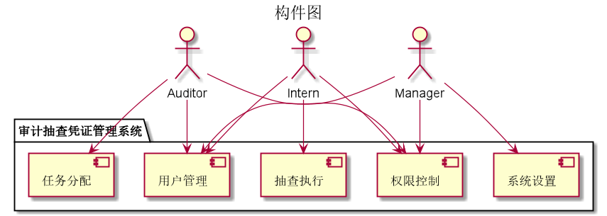
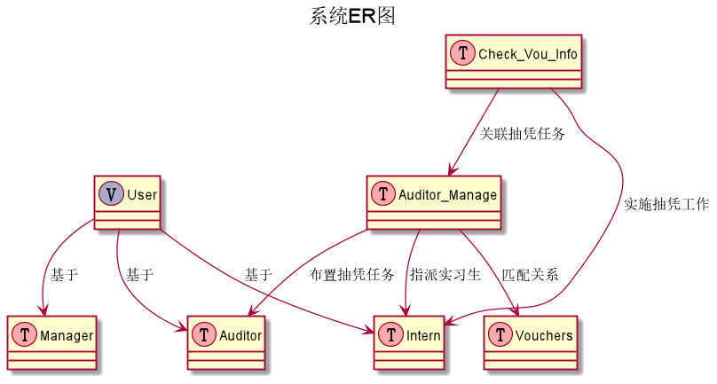
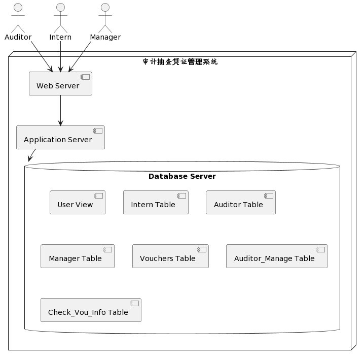
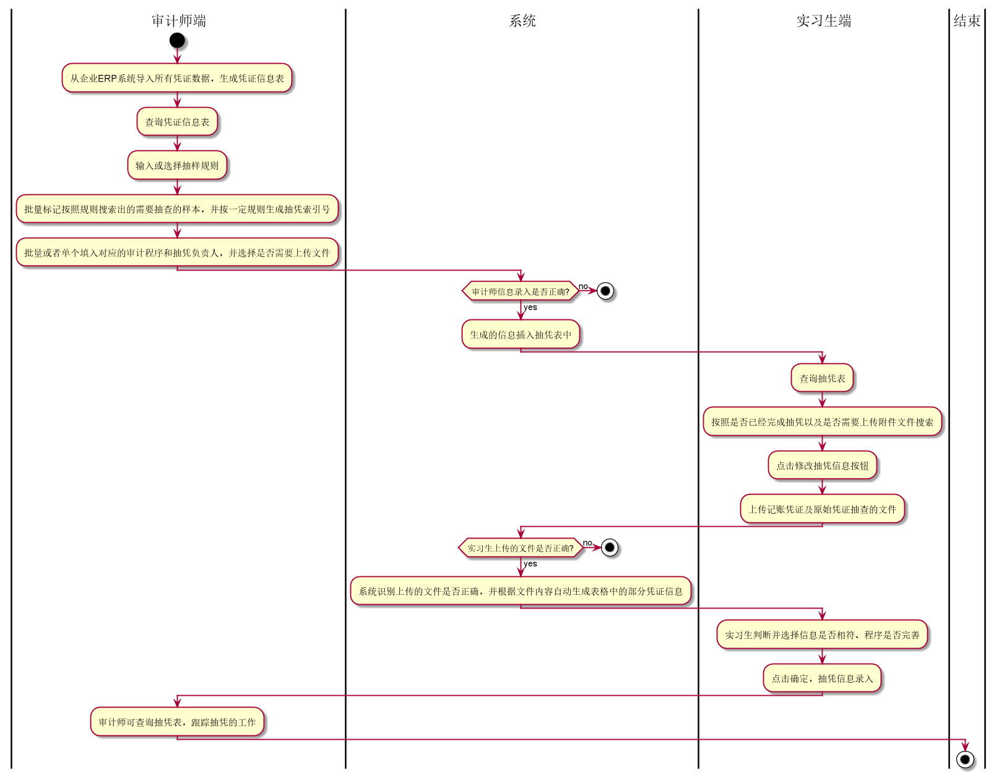
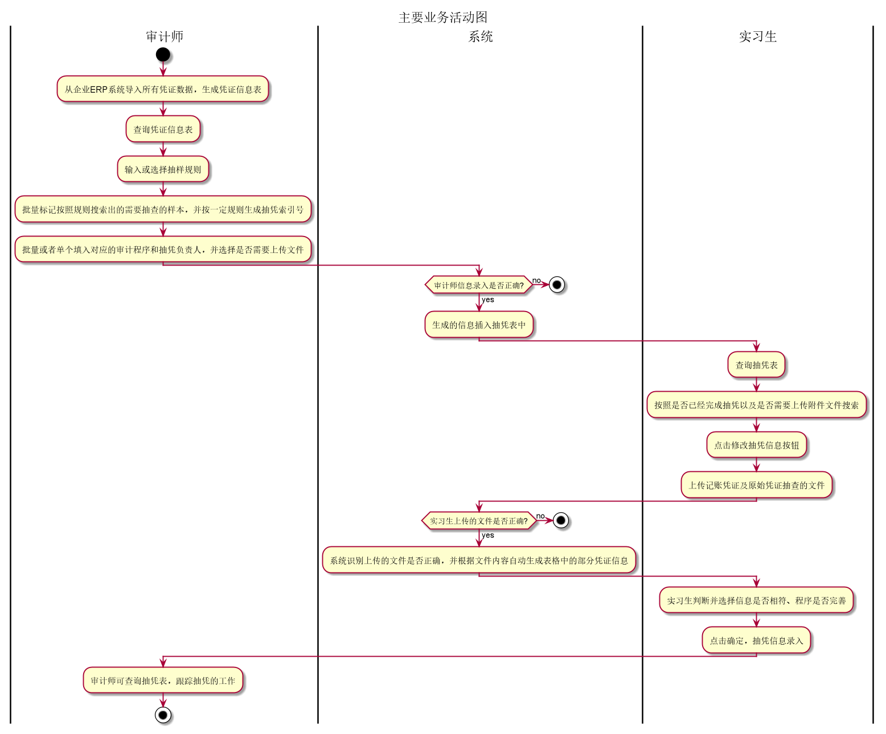
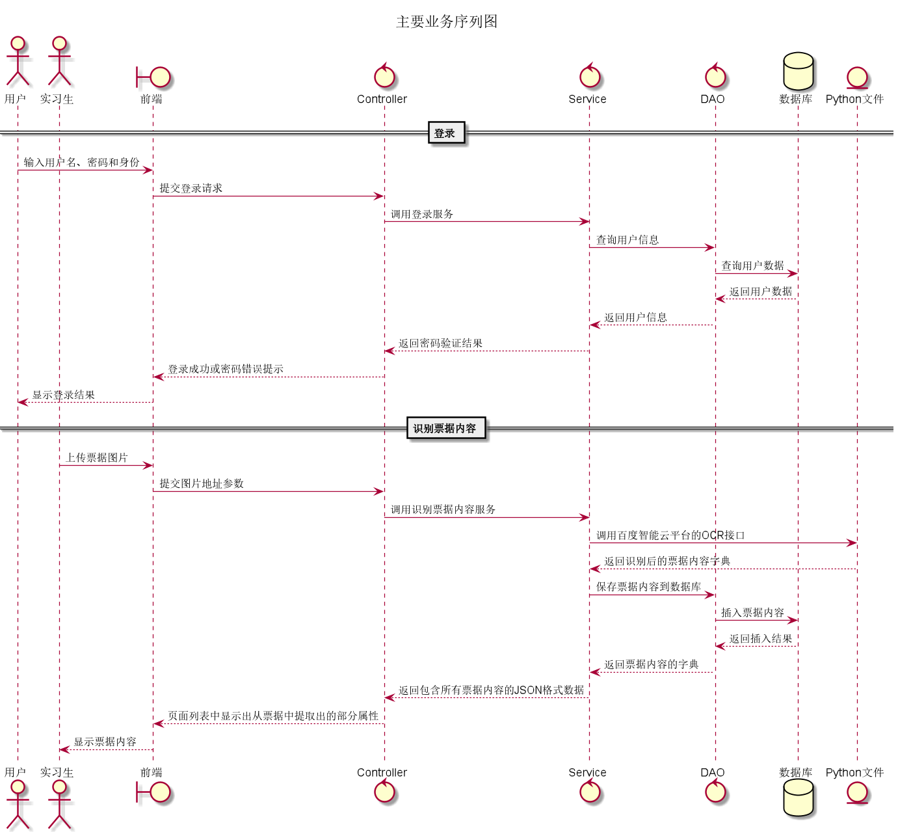
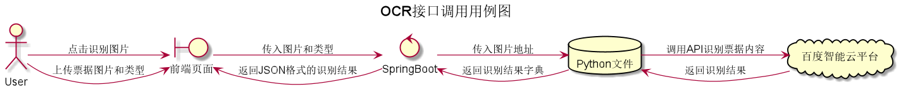
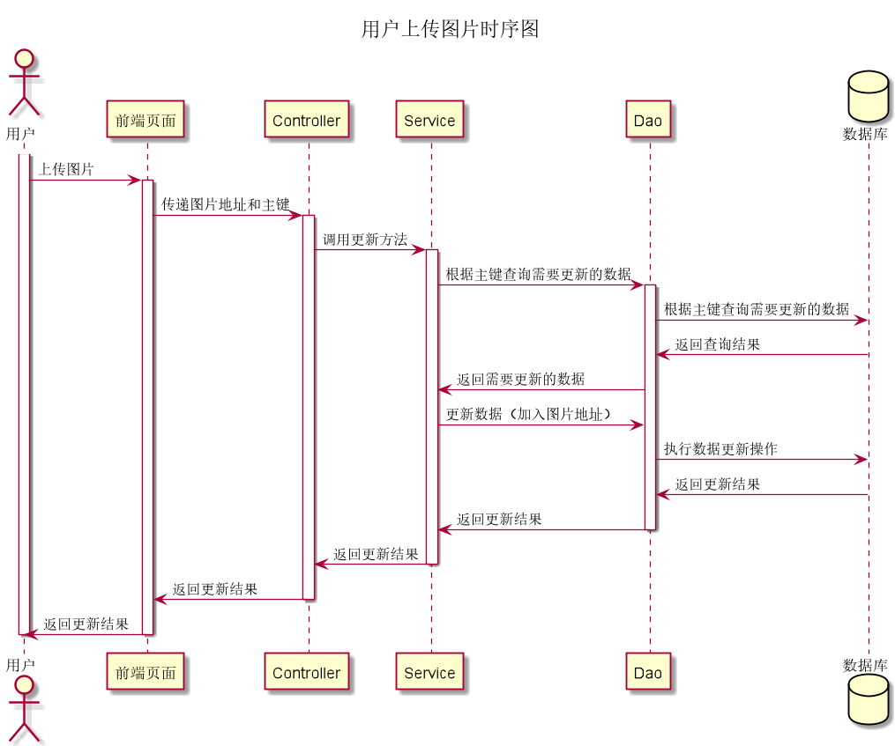
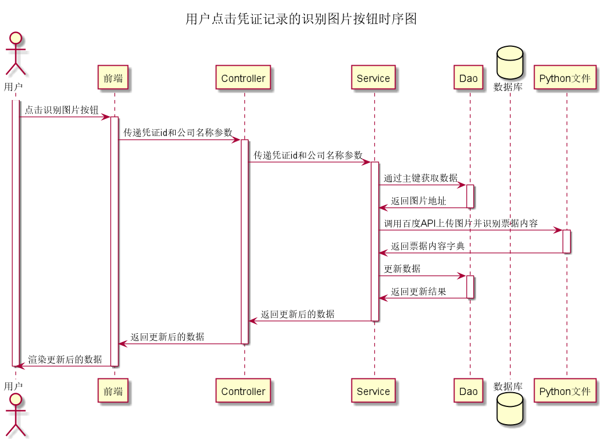
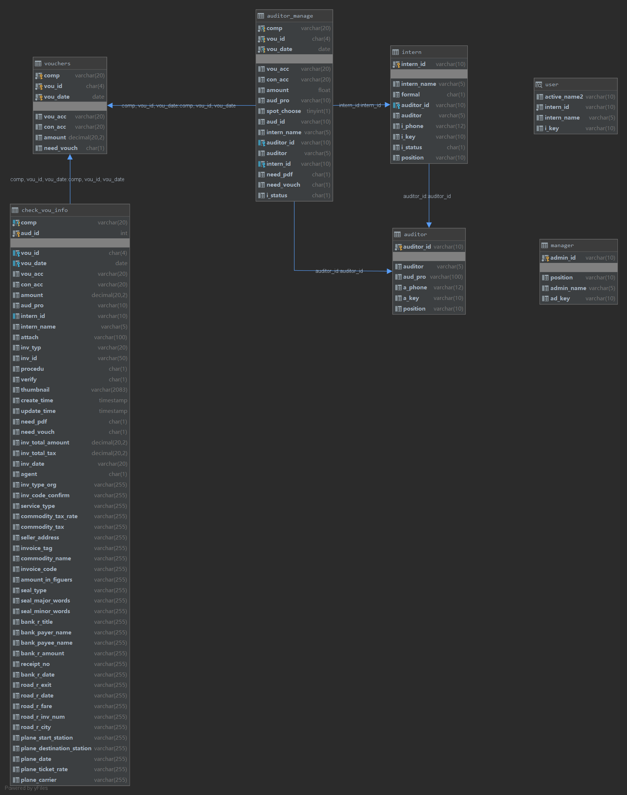

# Voucher Audit Management System (OCR-Enabled)

Chinese version: [README.zh-CN.md](README.zh-CN.md)

An end-to-end web platform for voucher spot-checking and audit collaboration across three roles: **Intern**, **Auditor**, and **Manager**.

## Project Motivation
This project came directly from my work as an **Audit Assistant Intern**.  
In daily work, many voucher-checking tasks were repetitive, manual, and time-consuming. I believed that a large part of this process could be automated, so I designed and built this system to reduce repetitive work, improve consistency, and increase review efficiency.

## Project Summary
This project manages voucher records, assignment workflows, evidence uploads, and OCR-assisted extraction for audit operations.

Business capabilities:
- Voucher master data management and search
- Role-based task assignment and review workflow
- Attachment/image upload and evidence tracking
- OCR-based invoice information extraction
- Spot-check result recording and verification status management

## Why Baidu OCR API in This Version
In this version, I used **Baidu OCR API** because it was more efficient and practical for my Chinese voucher scenarios than my early self-built OCR prototype pipeline.

Implementation evidence in this repo:
- OCR request scripts calling Baidu API endpoints:
  - `project/identify.py` (VAT invoice)
  - `project/bank_receipts.py`
  - `project/transfer_fee.py`
  - `project/plane_receipts.py`
  - `project/seal_identify.py`
- Java service invokes the Python OCR scripts:
  - `project/spot_check_voucher/src/main/java/com/design/spot_check_voucher/service/impl/CheckVouInfoServiceImpl.java`

## Tech Stack
- Backend: `Spring Boot 2.1.14.RELEASE`, `Java 8`
- Persistence: `MyBatis`, `tk.mybatis`, `PageHelper`, `MySQL`
- Frontend: server-hosted static HTML with `Vue`, `Axios`, `jQuery`, `ECharts`
- OCR integration: Python scripts + Baidu OCR REST API

## Software Structure
### Layered Architecture
- `controller`: HTTP endpoints and page routing
- `service`: business logic and orchestration
- `dao`: database access and SQL mapping
- `domain`: entity models (`Vouchers`, `CheckVouInfo`, `Auditor`, `Intern`, `User`)

### Repository Structure
```text
.
├── README.md
├── README.zh-CN.md
├── database/
│   └── sql/
├── docs/
│   └── design_assets/
├── project/
│   └── spot_check_voucher/
├── MLTest/
└── Test2/
```

## Architecture Diagrams (Referenced)
The diagram labels are mostly Chinese (legacy assets), but the file names and captions below are in English.

### 1) Module / Package Structure


- Controller package map: 
- Service package map: 
- DAO package map: 
- Domain package map: 

### 2) Architecture + Data + Deployment
- Component diagram: 
- ER model: 
- Deployment view: 
- System boundary PDF: [system-boundary-diagram.pdf](docs/design_assets/system-boundary-diagram.pdf)

### 3) Business and OCR Flows
- Main business overview: 
- Main activity flow: 
- Main sequence flow: 
- OCR API use case: 
- User upload sequence: 
- User identify-click sequence: 

## GUI Overview
### Main GUI Snapshot


### Role-Based Pages
- Login: `project/spot_check_voucher/src/main/resources/static/login.html`
- Intern home: `project/spot_check_voucher/src/main/resources/static/indexI.html`
- Auditor home: `project/spot_check_voucher/src/main/resources/static/indexA.html`
- Manager home: `project/spot_check_voucher/src/main/resources/static/indexM.html`

### Key UI Modules
- Voucher list: `vouchersList.html`
- Spot-check list: `checkVouInfoList.html`
- Auditor list: `auditorList.html`
- Intern list: `internList.html`

(All under `project/spot_check_voucher/src/main/resources/static/`.)

## Database Model
Primary scripts:
- `database/sql/spot_check_voucher2.sql`
- `database/sql/spot_check_voucher.sql`
- `database/sql/trigger.sql`

Core tables:
- `vouchers`
- `auditor_manage`
- `check_vou_info`
- `auditor`
- `intern`

## Main API Groups
- Auth/session: `POST /LoginSuccess`, `GET /getUserInfo`
- Voucher: `/spotCheckVoucher/findv|searchv|addv|updatev|delv`
- Spot-check details: `/spotCheckVoucher/find|search|add|update|del|identify`
- Auditor: `/spotCheckVoucher/finda|searcha|adda|updatea|dela`
- Intern: `/spotCheckVoucher/findi|searchi|addi|updatei|deli`
- File upload/delete: `/voucheck/fileupload`, `/voucheck/delfile`

## Run (Legacy Environment)
### Prerequisites
- JDK 8
- Maven 3.6+
- MySQL 8.x

### Start
```bash
cd project/spot_check_voucher
# initialize schema with database/sql/spot_check_voucher2.sql
./mvnw spring-boot:run
```

Default URL:
- `http://localhost:8888/login.html`

## 2026 Portfolio Refresh Notes
- Converted project structure and diagram asset names to English-friendly naming
- Added bilingual documentation support with English as the primary README
- Improved backend reliability (session timeout unit fix, safer login checks, cleaner user profile lookup, path handling fix for file deletion)
