# Voucher Audit Management System (OCR-Enabled)

Chinese version: [README.zh-CN.md](README.zh-CN.md)

An audit workflow platform built from real internship pain points: repetitive voucher checks, manual entry, and fragmented auditor-voucher-checker collaboration.

## 60-Second Skim
- **What I built:** a role-based voucher audit workflow system (`Auditor` / `Voucher Checker` / `Admin`).
- **Why I built it:** my Audit Assistant internship had repetitive, manual, error-prone voucher checks.
- **Core value:** batch assignment + OCR-assisted extraction + structured verification workflow.
- **Tech stack:** Spring Boot, MyBatis, MySQL, Vue/jQuery frontend, Python OCR bridge.
- **OCR choice:** Baidu OCR API (better fit for Chinese voucher/invoice scenarios in this project stage).
- **Main outcomes:** reduced repetitive data entry, clearer task ownership, fewer duplicate/missed checks.
- **Proof in this repo:** architecture diagrams, GUI screenshots, API mapping, and test-summary evidence.

## Project Motivation
This project came directly from my work as an **Audit Assistant Intern**.

In real engagements, voucher spot-check tasks were often manual and repetitive, assigned ad hoc by multiple auditors, and prone to duplicate checks, missed checks, and attachment mismatch errors.

I built this system to automate the repetitive parts, standardize the workflow, and make task tracking clearer for both auditors and voucher checkers.

## What Problem It Solves
Based on the original project documents, the system targets five practical issues:
- duplicate voucher sampling across teams
- unstructured voucher-checker task assignment and progress tracking
- high manual input effort for voucher attachment fields
- quality risks caused by incomplete verification steps
- permission and data-exposure control during audit execution

## Solution Overview
The platform supports three roles: **Auditor**, **Voucher Checker**, and **Admin**.
In the legacy code/database naming, this role is labeled as `intern`.

Core flow:
1. Auditor imports or queries voucher data.
2. Auditor filters vouchers and assigns spot-check tasks in batch.
3. Voucher Checker uploads voucher attachments.
4. System calls OCR to extract fields and prefill records.
5. Voucher Checker confirms consistency/procedure completeness.
6. Auditor reviews status and follows up exceptions.

## Software Structure
### Layered architecture
- `controller`: HTTP endpoints and request handling
- `service`: business rules and orchestration
- `dao`: persistence and query layer
- `domain`: entities and value objects

### Package diagrams
- Root package map: 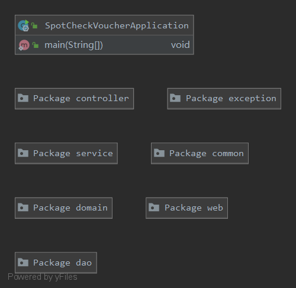
- Controller layer: 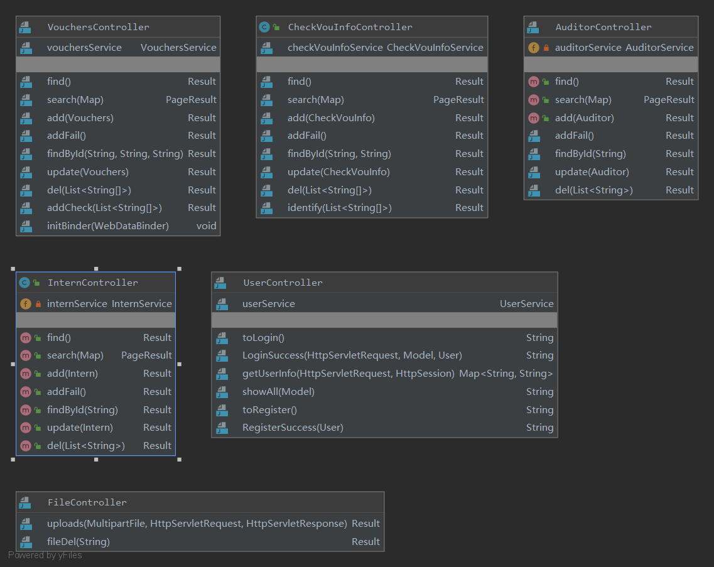
- Service layer: 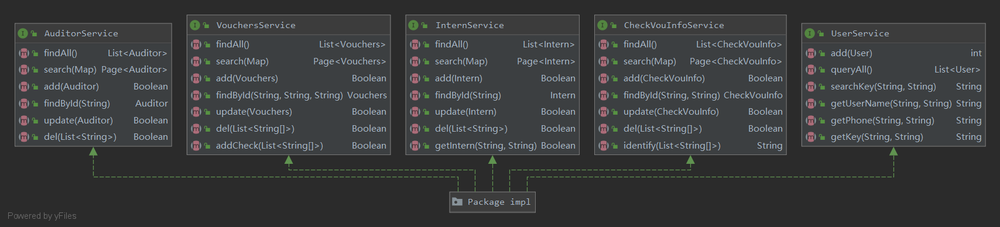
- DAO layer: 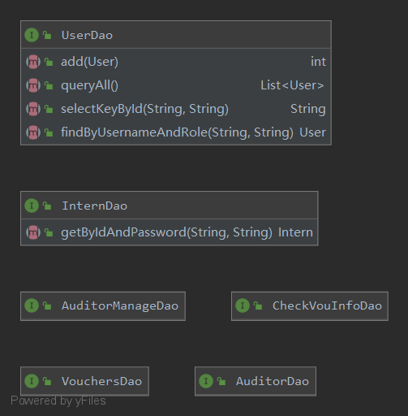
- Domain model layer: 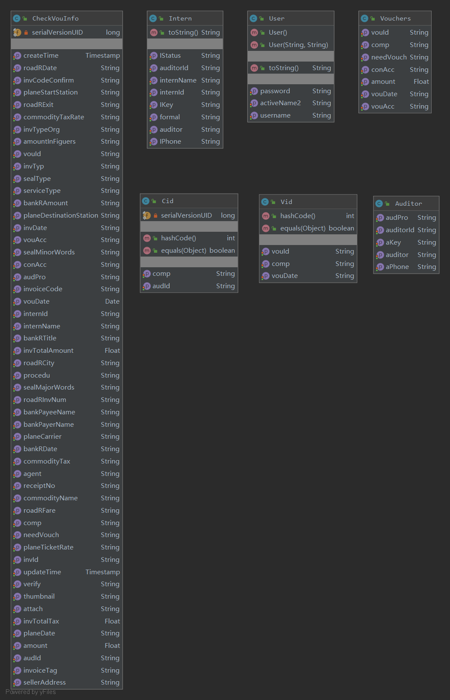

### Data model
- ER model: 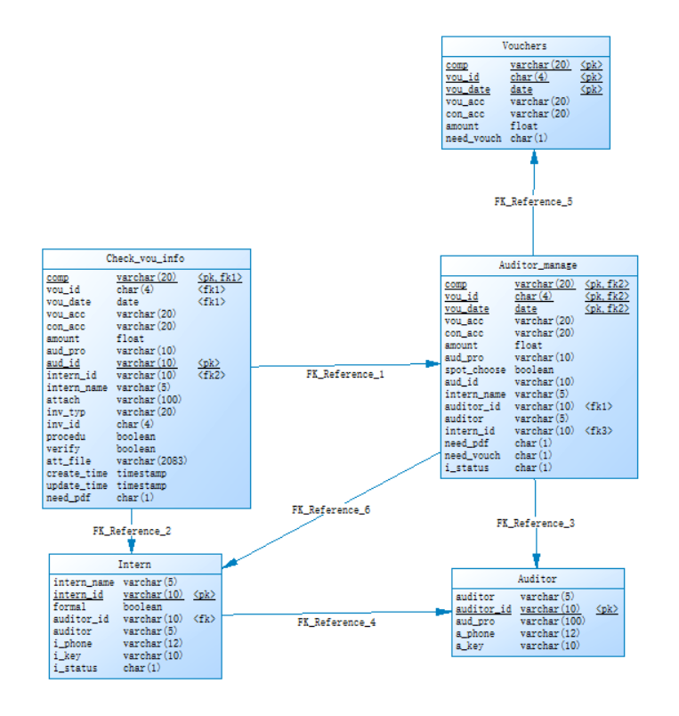
- Database schema view: 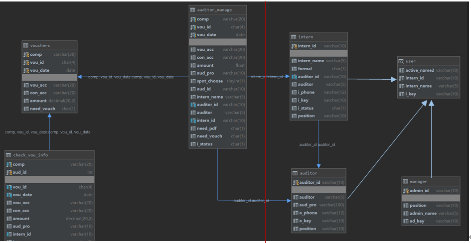

Primary scripts:
- `database/sql/spot_check_voucher2.sql`
- `database/sql/spot_check_voucher.sql`
- `database/sql/trigger.sql`

Main tables:
- `vouchers`
- `auditor_manage`
- `check_vou_info`
- `auditor`
- `intern`

## GUI Showcase (Copied From Original Documents)
### Login
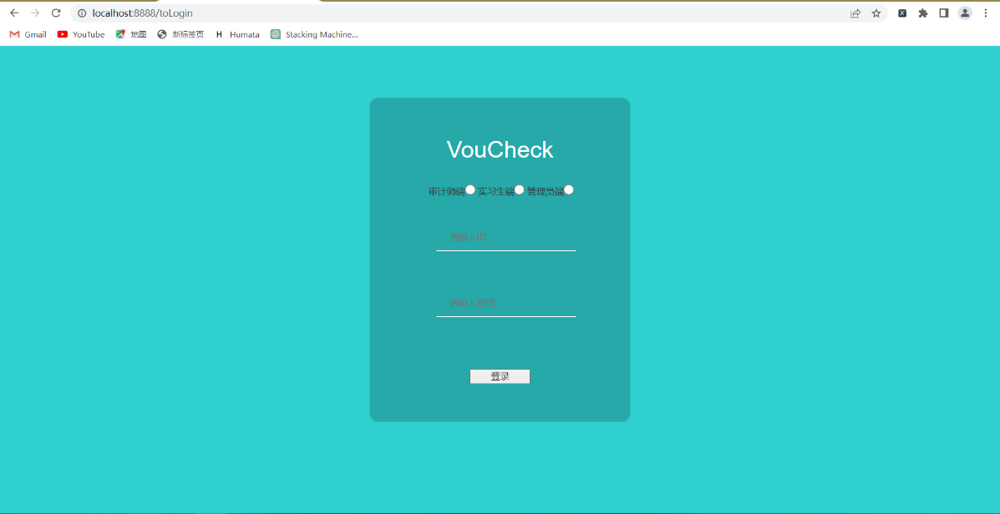

### Auditor home
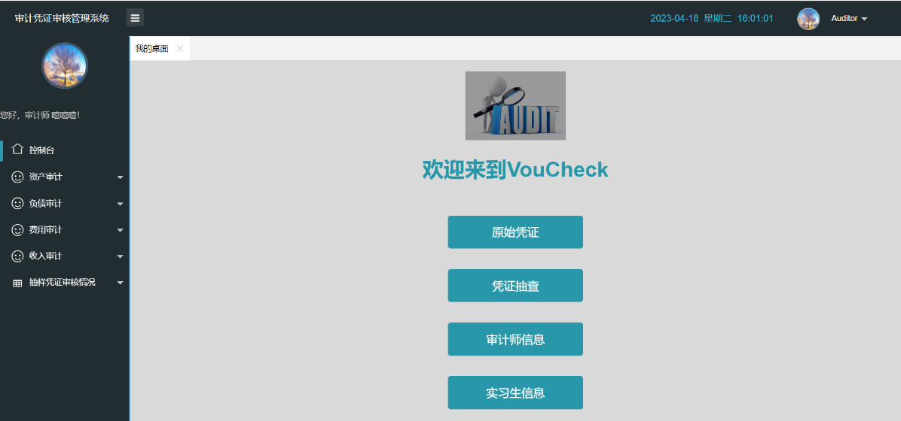

### Auditor voucher list
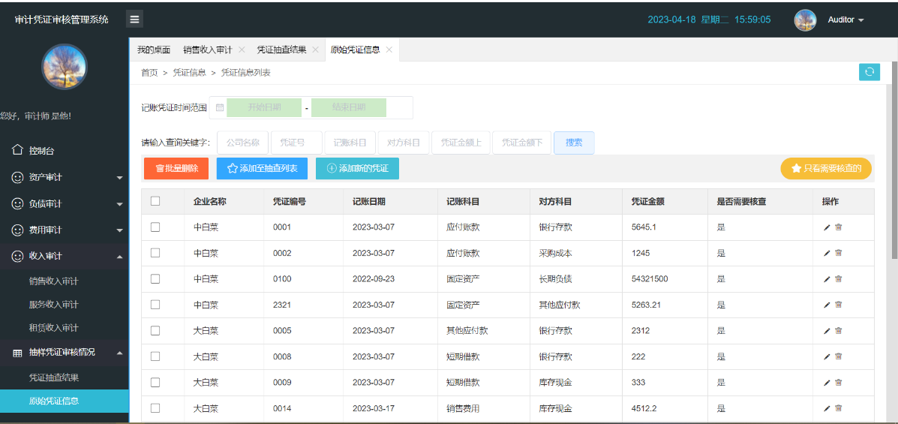

### Voucher Checker spot-check list
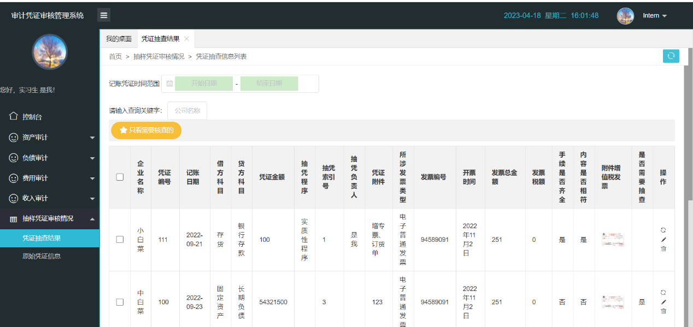

### Admin security/settings page
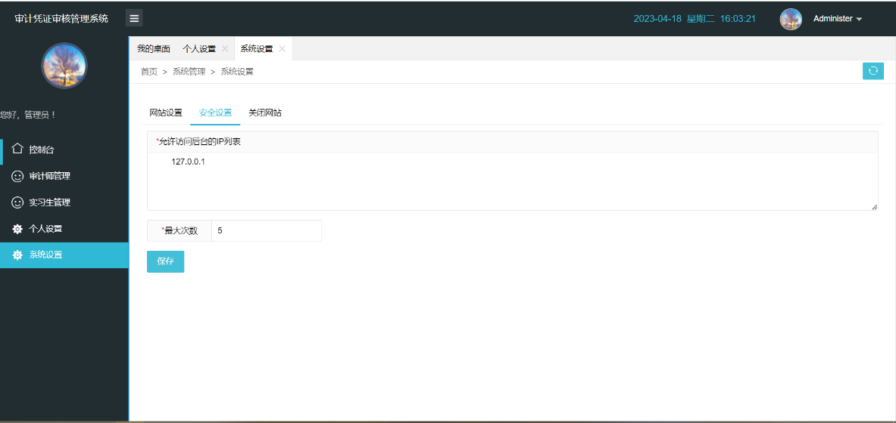

### OCR recognition success example
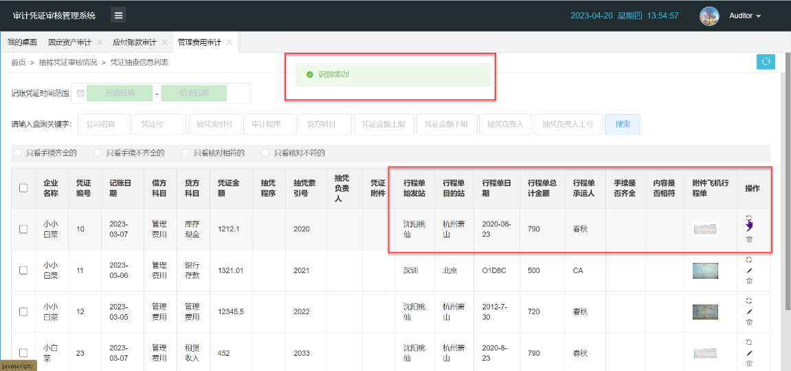

## OCR Integration (Why Baidu OCR API)
In this implementation, I used **Baidu OCR API** because it was more efficient and practical for Chinese invoice/voucher scenarios than my early self-built OCR experiments.

Integration path in this codebase:
- Python OCR wrappers calling Baidu endpoints:
  - `project/identify.py`
  - `project/bank_receipts.py`
  - `project/transfer_fee.py`
  - `project/plane_receipts.py`
  - `project/seal_identify.py`
- Java service trigger:
  - `project/spot_check_voucher/src/main/java/com/design/spot_check_voucher/service/impl/CheckVouInfoServiceImpl.java`

Supported recognition scenarios captured in project docs:
- VAT invoice
- bank receipt
- airfare itinerary receipt
- toll/bridge fee invoice
- stamped contract/seal-related recognition

## Key Functional Scope
- role-based login and user profile/session handling
- voucher CRUD + filtering + batch operations
- batch generation of spot-check index/task assignment
- voucher-checker-side upload + OCR-assisted field extraction
- verification flags (procedure completeness / content consistency)
- admin-side user management and system settings

Representative APIs:
- `POST /LoginSuccess`, `GET /getUserInfo`
- `/spotCheckVoucher/findv|searchv|addv|updatev|delv`
- `/spotCheckVoucher/find|search|add|update|del|identify`
- `/spotCheckVoucher/finda|searcha|adda|updatea|dela`
- `/spotCheckVoucher/findi|searchi|addi|updatei|deli`
- `/voucheck/fileupload`, `/voucheck/delfile`

Note: endpoint group `...findi/searchi/addi...` uses historical `intern` naming, which maps to the **Voucher Checker** role in this README.

## Quality Targets and Test Evidence (From Original Docs)
Documented target metrics:
- page load time: under 2s
- query response: under 500ms
- form submit response: under 1s
- API response expectation: under 1000ms
- throughput target: at least 100 requests/second

Documented test approach:
- manual functional tests for all role modules
- OCR API test cases by receipt type
- performance profiling with JProfiler

Documented test summary:
- core functional flows passed
- OCR extraction worked well overall, with expected accuracy drops in complex/noisy cases
- non-functional aspects were identified as future optimization areas

## Tech Stack
- Backend: `Spring Boot 2.1.14.RELEASE`, `Java 8`
- Persistence: `MyBatis`, `tk.mybatis`, `PageHelper`, `MySQL`
- Frontend: static pages served by Spring Boot, `Vue`, `Axios`, `jQuery`, `ECharts`
- OCR integration: Python scripts + Baidu OCR REST API

## Workflow & Graphs (Copied From Original Documents)
Most of the text labels in these source diagrams are Chinese. They are kept as supporting evidence and moved to this later section for reference.
These images were copied out of the `documents` folder into stable paths under `docs/readme_assets/portfolio/`, so the README stays valid after `documents` is removed.

### Cross-role workflow
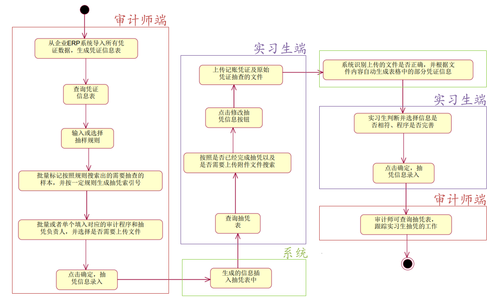

### Main business activity (swimlane)
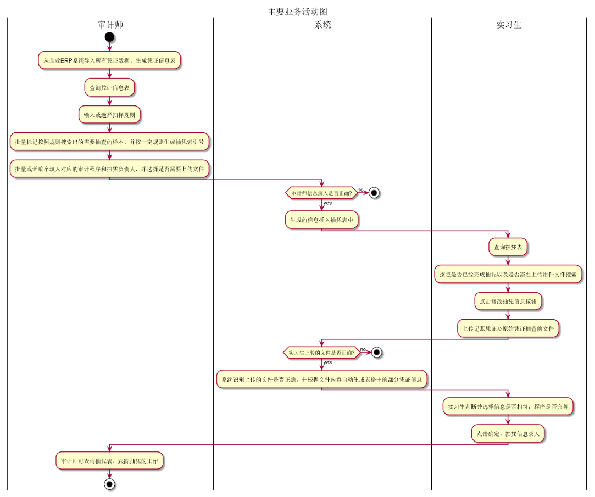

### Main sequence with OCR call path
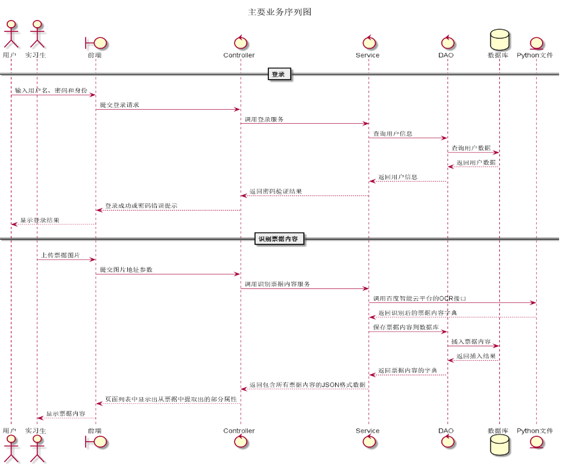

### OCR API use-case path
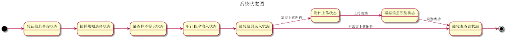

## Project Structure
```text
.
├── README.md
├── README.zh-CN.md
├── database/
│   └── sql/
├── docs/
│   ├── design_assets/
│   └── readme_assets/
├── project/
│   └── spot_check_voucher/
├── MLTest/
└── Test2/
```

## Run (Legacy Environment)
### Prerequisites
- JDK 8
- Maven 3.6+
- MySQL 8.x

### Start
```bash
cd project/spot_check_voucher
# initialize schema with database/sql/spot_check_voucher2.sql
./mvnw spring-boot:run
```

Default URL:
- `http://localhost:8888/login.html`

## 2026 Portfolio Refresh Notes
- Converted documentation and folder naming to industry-facing English
- Copied key diagrams and GUI evidence out of archived `documents` content into stable `docs/` assets
- Kept Chinese README as companion documentation
- Applied targeted backend reliability fixes in the legacy codebase
